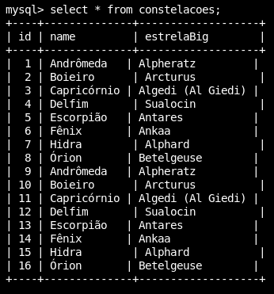

### Criando uma imagem aparti de um *Dockerfile* 
`-t`  |  tag  significa que estamos dando um nome para  a nossa imagem <br>
  
`-f`  |  expecifica o arquivo Dockerfile para gerar a imagem <br>
  
`.`  |  significa que o contexto para gerar a imagem vai ser da pasta que estou executando no momento <br>

`docker build -t mysql-image -f api/db/Dockerfile .`


`docker image ls`  |  lista as imagens <br> 

---

### Criando e rodando uma imagem com apelido apati de outra imagem
`-d`  |  detect, para executar o comando em background <br>

`--rm`  |  remove o container e cria outro no lugar <br>
`--name`  |  *nome do container* +  *imagem a ser usada no cantainer* <br>


`docker run -d --rm --name mysql-container mysql-image`


`docker ps`  |  para ver  os containers que estão rodando no momento <br>

---

### Mysql
> *restore do banco*

`-i`  |  permite que o processo não será finalizado até que seja concluido <br>

`mysql-container`  |  container a ser usado <br>

`mysql`  |  detect, para executar o comando em background <br>

`-u<user>`  |  usuário <br>

`-p<password>`  |  senha do usuário <br>

` < <script.sql>`  |  caminho do script.sql <br>
  
`docker exec -i mysql-container mysql -uroot -pmarod < api/db/script.sql`
  
> *acessando o banco*
  
`-t`  |  tty, terminal <br>

`docker exec -it mysql-container /bin/bash`

`mysql -uroot -pmarod`  |  usaremos mysql *-u<user> -p<password>* <br>

`use marod`  |  o nome do banco <br>

`select * from constelacoes;`  |  comando sql <br>

<div align="center">
    
</div>

`exit`  |  sair <br>

`exit`  |  sair <br>

`docker stop mysql-container`  |  para o container

___mas assim todos os dados seriam perdidos logo após que o container fosse parado___

> *para que os dados sejam mantidos no banco*

`-v`  |  volume <br>

`$(pwd)/api/db/data:/var/lib/mysql`  |  pasta do host, o caminho de cada pasta é separado por ___:___ <br>
`pwd`  |  retorna a pasta atual <br>
`/var/lib/mysql`  |  onde fica o mysql e toda estrutura do banco <br>

`docker run -d -v $(pwd)/api/db/data:/var/lib/mysql --rm --name mysql-container mysql-image`

`docker inspect mysql-container`  |  inspeciona o container <br>

---

### Criando o container do node
*certifiqui-se de ter a mesma versão do node instalado na sua máquina*

`cd api` <br>
`npm init -y`  |  instalar as dependencias node <br>
`npm i --save-dev nodemon`  |  nodemon para a api atualizar automaticamente <br>
`npm i --save express mysql`  |  express para fazer nossa rota, mysql para instalar os drives <br>

> *insira no `packet.json` em scripts:*

```
"start": "nodemon ./src/index"
```

> *criando a imagem aparti da Dockerfile*

`docker build -t node-image -f api/Dockerfile .`

> *criando e rodando uma imagem com apelido apati de outra imagem*

`-p 9001:9001`  |  expecificando as portas, porta host ___:___ porta container <br>

`docker run -d -v $(pwd)/api:/home/node/app -p 9001:9001 --rm --name node-container node-image`

> *criando e rodando uma imagem com apelido apati de outra imagem com o link de outro container*

`--link mysql-container`  |  link + o nome do container <br>


`docker run -d -v $(pwd)/api:/home/node/app -p 9001:9001 --link mysql-container --rm --name node-container node-image`

---

### Aplicação web *php*
> *criando a imagem aparti da Dockerfile*

`docker build -t php-image -f website/Dockerfile .`

> *criando e rodando uma imagem com apelido apati de outra imagem com o link de outro container*

`docker run -d -v $(pwd)/website:/var/www/html -p 8888:80 --link node-container --rm --name php-container php-image`